# Java-Employee-salary-Sysmtems---Sistema_Nomina
Employ Salary System, in Java with MySQL, all the Data Base is based in MySQL and is on the Code, The code is based in Java Code, V 1.6

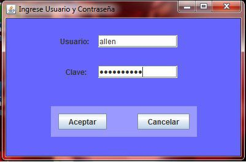
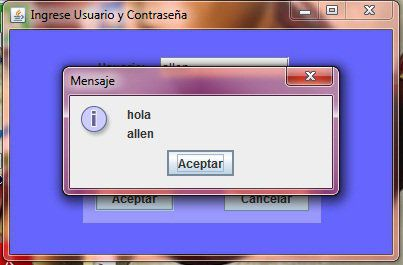
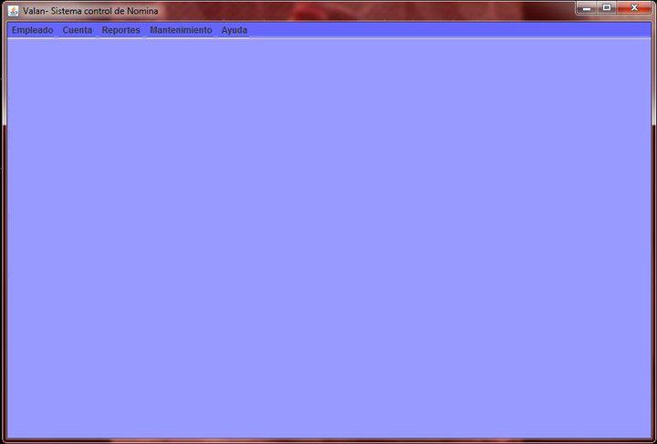

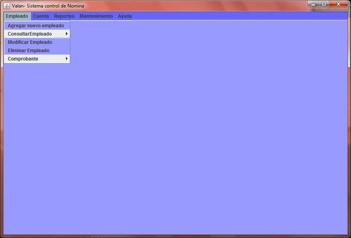
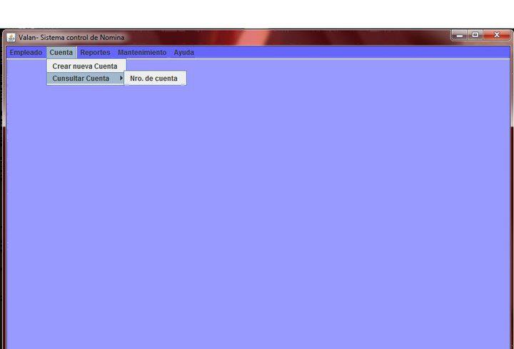
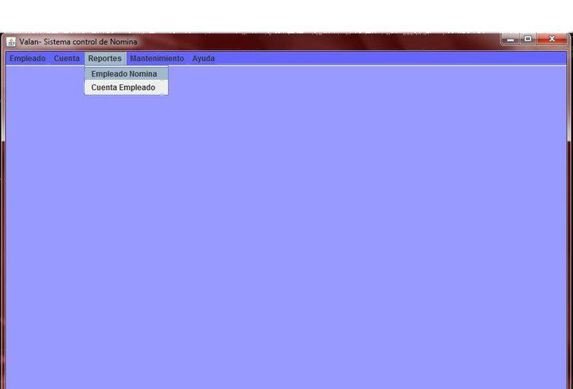
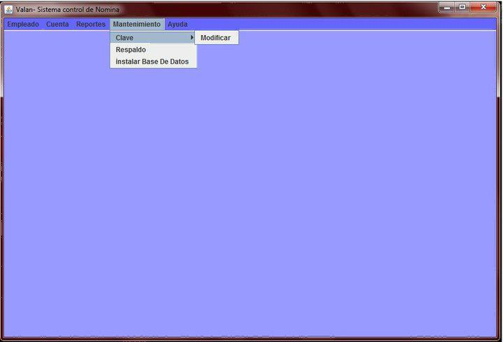
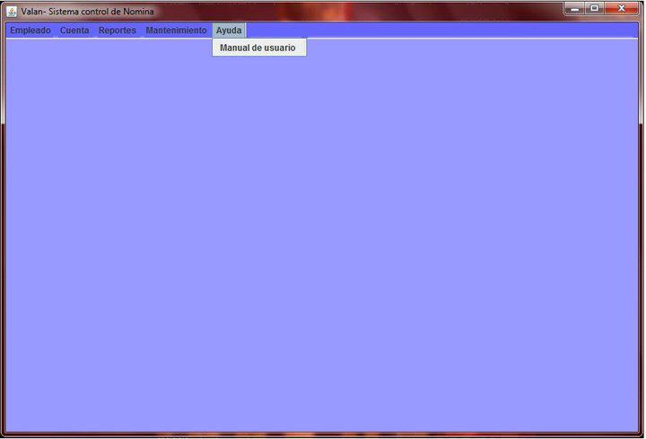
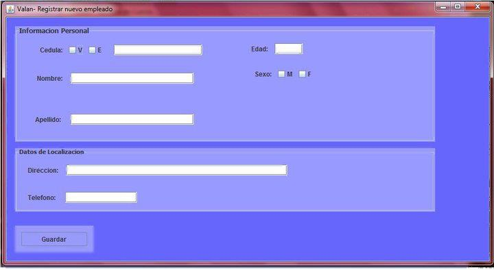

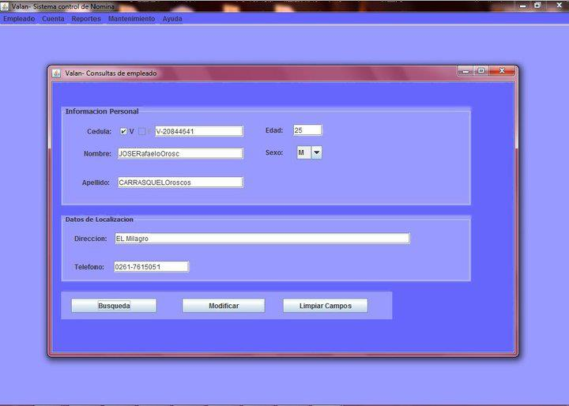
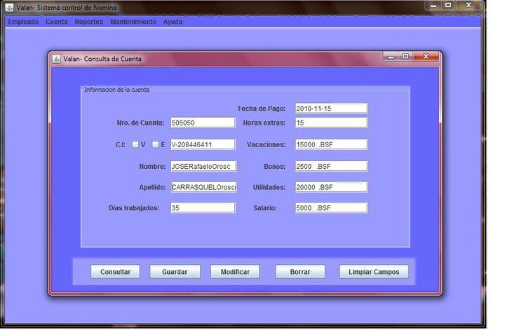
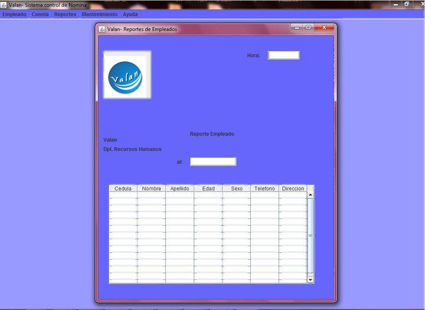
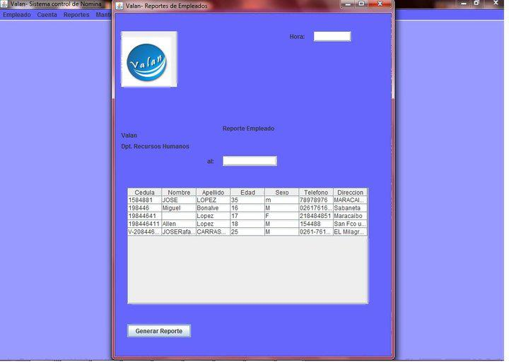
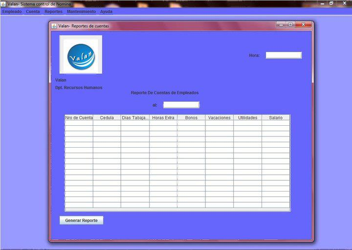
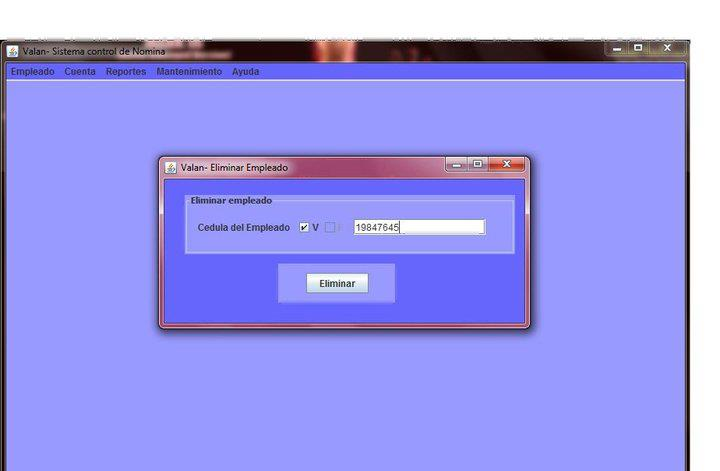
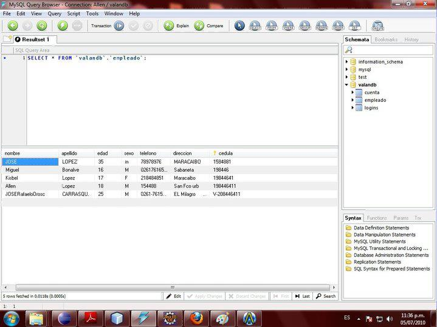
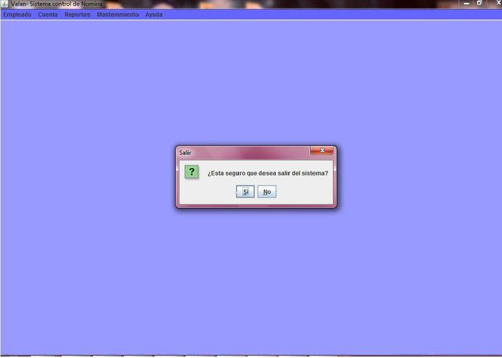
